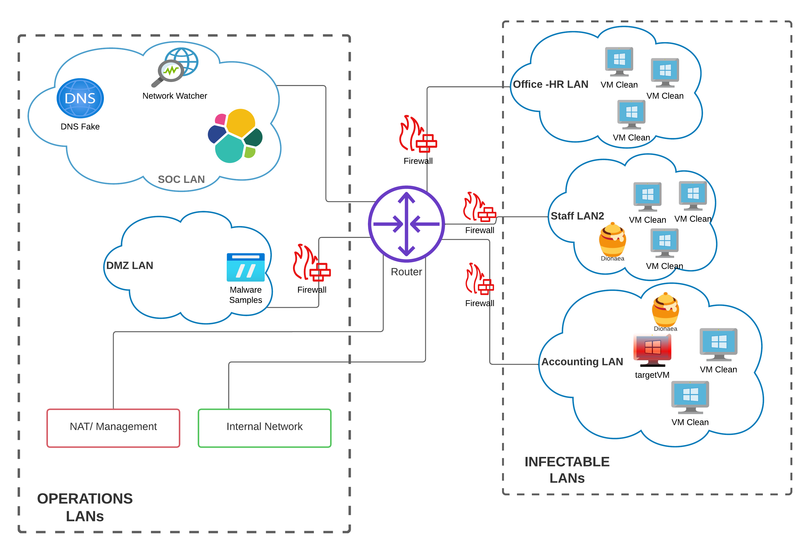

# Malware Sandbox

Welcome to the Malware Sandbox repository! This project offers a comprehensive environment for safely and controlled analyzing malware. The primary goal is to facilitate the creation of an environment with multiple networks interconnected to study malware behavior. 

**Rest assured, this repository is free from any harmful content. No Malware samples are present.**

## Architecture Overview
The sandbox environment creates an architecture that includes interconnected networks and devices. The core components consist of:

- Five Local Area Networks (LANs) linked together through an OPNSense router.
- Three infectable LANs designed to simulate vulnerable environments.
- Two operational networks: SOC LAN and DMZ LAN.

For visual reference, you can check out the Sandbox Architecture Diagram. This diagram provides an overview of how the different components interact within the sandbox environment, further, you can check for specific details [Wiki](https://github.com/aau-network-security/sandbox/wiki). 

 

### How to run?

To run this, you need to be on a Linux-based system. First, you must specify the folder where the platform can look
for *.ovafiles*. Update **ova-dir** from `config.yml` according to your needs. You will need to provide specific configuration files (such as the scenarios/scenario.yml) to populate the infectable LANs with appropriate docker containers and Windows virtual machines.

> `config/config.yml`

Sandbox works on 2 parameters:

1. Tag -- Name of the experiment (e.g `test`); default comes with **test**;
2. blockNo -- number of the parallel blocks of the environment; default value is **1**

### Start sandbox simple use

`go run main/main.go -tag='name_here' -noblk='number_here'` 

### Stop & Clean

`Ctrl+C`

`bash scripts/clean.sh`

### Requirements

- [**Go**](https://golang.org/doc/install)
- [**VirtualBox**](https://www.virtualbox.org/wiki/Linux_Downloads)
- [**Docker**](https://docs.docker.com/engine/install/ubuntu/)
- [**OpenVswitch**](https://www.openvswitch.org)
- [**ovs-docker**](https://github.com/aau-network-security/openvswitch/blob/master/scripts/ovs-docker) - this file
  should replace the one existing at
  `/usr/bin/ovs-docker`
- targetVM.ova
- OPNsense.ova
- FTP files for malware
- ELK - monitoring infrastructure. 
